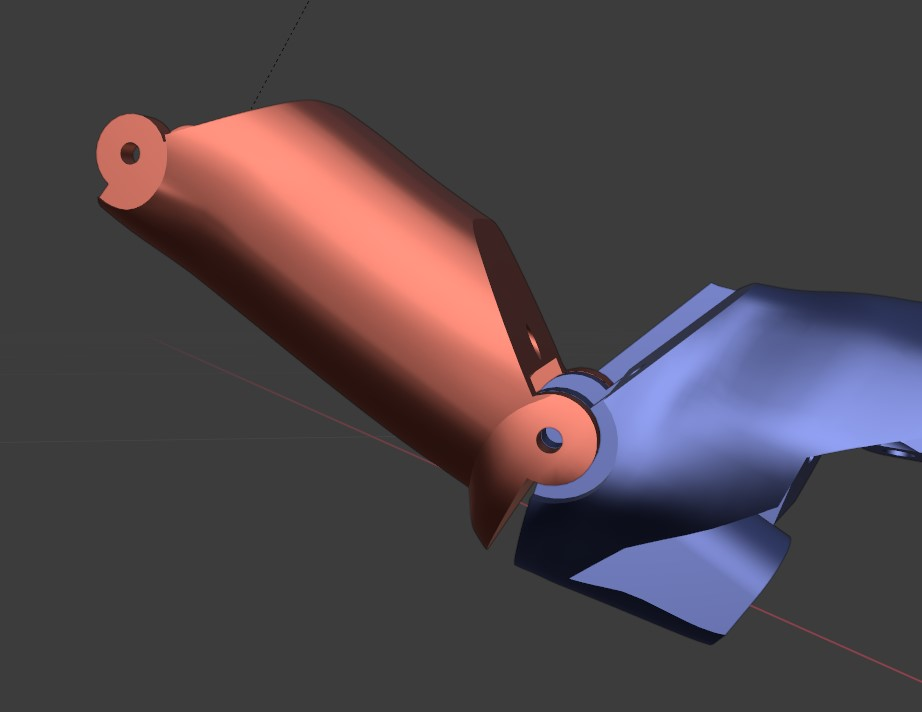

# Example Usage
Let's say you have a series of mesh files you want to assemble and export as an MJCF. They may be mis-aligned in relation to each other. This guide will cover what structure the plugin expects during exporting, as well as some of the basic Blender tools available to you to organize your scene. We'll use the example of a prosthetic hand's finger. (Model kindly provided by Jumpei Kashiwakura[^1])

[^1]: J. Kashiwakura, P. G. Sagastegui Alva, I. M. Guerra, C. Bona, S. F. Atashzar and D. Farina, "Task-Oriented Design of a Multi-Degree of Freedom Upper Limb Prosthesis With Integrated Myocontrol and Sensory Feedback," in IEEE Transactions on Medical Robotics and Bionics, vol. 5, no. 4, pp. 1067-1081, Nov. 2023, doi: 10.1109/TMRB.2023.3310717.

## Step 1: Load your files
Preferably from a series of `.stl` files or a `.fbx` or similar format.

If you are unlucky they won't be properly parented, or have many nested unnecessary transforms, and the transforms may be misaligned with the joints. We'll edit the objects so they better correspond to the `q0` of our desired MuJoCo model.

To get around the misalignment with the joint axes, you could add and parent "Empty" axes objects (`Shift+A` in Object mode) and parent them to the right body then align them, but this will lead to a cluttered MJCF. We'll cover how to clean up this scene

## Step 1.5: Edit meshes (Optional)
You may want to perform operations on your meshes, such as decimating the mesh to reduce vertex count, or scaling the meshes up or down (edit the scale in the transform tab, then apply scale by selecting the option after pressing `Ctrl+A`. Unapplied scale will not be used in the export).
## Step 2: Setting origins

As you saw on the first figure and on this close up of the proximal index segment, the bodies may not be at resting position, or may be entirely offset. We'll use the cursor tool to define our desired orientation of the body frame. Select the Geometry option for the cursor orientation and click on a surface that is perpendicular to the joint axis (the side of the joint here). This will align the cursor with the surface normal there.
In addition to the orientation we'll also need the right origin position. We want to specify it as the midpoint of the joint axis that passes through the revolute joint. Enter Edit mode with `Tab`. Make a balanced selection of elements (e.g. vertices) on both side of the joint. You can add to your selection by holding down `Shift`, or remove from it with `Ctrl`.

Once you have the relevant selection, you can move your Cursor tool to the mean position with `Shift+S` then `Cursor to selection`. Now the cursor is at the right position. The orientation will be unchanged from when we set it to match the geometry. 

Now you will copy the position of the cursor to the body's position. Select the body in question in Object mode (might need to press `Tab` again to switch to it, or you can do the switching in the top left corner). Then you can select `Object>Origin>Set Origin>Origin to 3D cursor` to move the object frame to start at the cursor. 

You still need to also change the orientation of the frame.

Specify in the top toolbar that you will be using the Cursor Tool as your reference transform (see figure). We will align the origin to it, but for this you need to specify that the next operation will only be performed on the origin of the frame (and not move the mesh itself). See figure above. Afterwards you can select `Object>Transform>Align to Transform Orientation`. Now the origin is both at the position and orientation of the cursor. The same `Align to Transform Orientation` can be a useful tool for rotating bodies with relation to each other, but if you want to move the mesh too, don't forget to untick the "Origins only" option.

Here I aligned the Cursor tool with the geometry of the palm, then aligned the proximal finger segment with it so it is fully extended.

Then I repeated the all the steps for the distal finger segment to set its origin/body frame to a clean pose too. To move the shifted distal segment to where the proximal terminated, I placed the cursor to the midpoint of the proximal semgent, selected the distal segment with the corrected origin, then used `Shift+S>Selection to cursor`. Afterwards there was a 90 degree offset I needed to fix, which I performed with the rotate tool (while holding down the `Ctrl` key to snap to exact 5 degree increments)

## Step 3: Parenting
I recommend cleaning up the hierarchy so there are no nested bodies without meshes (or geoms). To parent a body to another one, select first the child, then the parent either in view or the hierarchy (hold down `Ctrl`) and use `Ctrl+P>Object (Keep Transform)`.

With origins corrected, bodies aligned and parented, this how the hierarchy and view looks:

## Step 4: Sites, other elements
Add empty objects to represent sites or joints. This can be particularly helpful for specifying sites spatial joints. You can align the sites to the cursor the usual way. Edit its scale to change the size of the visual geom once exported. Check the main README to see which empty type corresponds to what element.

## Step 5: Export and edit
Now you are ready to export. Select the root body in the view, then the `Export` option in the `File` tab and click on `MJCF` (assuming the plugin is installed correctly).

The meshes will exported to a new folder next to where you specified the MJCF to be saved, and will be automatically referenced in the XML.
Make further necessary edits to your XML afterwards. E.g. since all the body frames were aligned with the intended joint axes, all we have to do is add a `<joint/>` element for the moving bodies, and we don't need to additionally define precise axes/positions. Nice!

